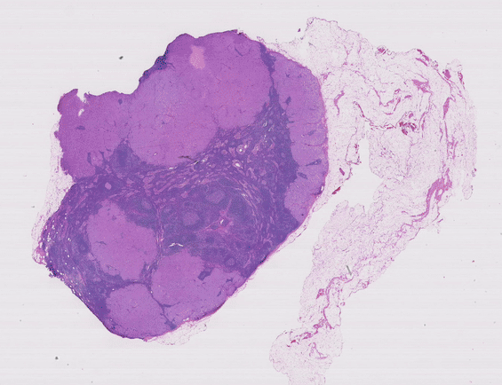

<!-- Improved compatibility of back to top link: See: https://github.com/othneildrew/Best-README-Template/pull/73 -->
<a id="readme-top"></a>
<!--
*** Thanks for checking out the Best-README-Template. If you have a suggestion
*** that would make this better, please fork the repo and create a pull request
*** or simply open an issue with the tag "enhancement".
*** Don't forget to give the project a star!
*** Thanks again! Now go create something AMAZING! :D
-->


<!-- PROJECT SHIELDS -->
<!--
*** I'm using markdown "reference style" links for readability.
*** Reference links are enclosed in brackets [ ] instead of parentheses ( ).
*** See the bottom of this document for the declaration of the reference variables
*** for contributors-url, forks-url, etc. This is an optional, concise syntax you may use.
*** https://www.markdownguide.org/basic-syntax/#reference-style-links
-->


<!-- PROJECT LOGO -->
<br />
<div align="center">
  <a href="https://github.com/othneildrew/Best-README-Template">
    
  </a>

  <h3 align="center">Attention-based Deep Multiple Instance Learning <br> --------------------------- <br> Histopathology-Bags <br> --------------------------- <br> MNIST-Bags </h3>
</div>


<!-- TABLE OF CONTENTS -->
<details>
  <summary>Table of Contents</summary>
  <ol>
    <li>
      <a href="#about-the-project">About The Project</a>
      </ul>
    </li>
    <li>
      <a href="#getting-started-with-histopathology">Getting Started with Camelyon16 Dataset (Histopathology)</a>
      <ul>
        <li><a href="#installation">Installation</a></li>
        <li><a href="#camelyon16-dataset-curation">Camelyon16 Dataset curation</a></li>
        <li><a href="#camelyon16-model-training">Camelyon16 Model Training</a></li>
        <li><a href="#camelyon16-visualization">Camelyon16 Visualization</a></li>
      </ul>
    </li>
    <li>
      <a href="#getting-started-with-mnist-dataset">Getting Started with MNIST Dataset</a>
      <ul>
        <li><a href="#installation">Installation</a></li>
        <li><a href="#mnist-dataset-curation">MNIST Dataset curation</a></li>
        <li><a href="#mnist-model-training">MNIST Model Training</a></li>
        <li><a href="#mnist-visualization">MNIST Visualization</a></li>
      </ul>
    </li>
    <li><a href="#license">License</a></li>
    <li><a href="#contact">Contact</a></li>
    <li><a href="#acknowledgments">Acknowledgments</a></li>
  </ol>
</details>


<!-- AUTHORS -->
## Authors

* Cederic Aßmann
* Friedrich Hagedorn
* Jakub Sliwa


<!-- ABOUT THE PROJECT -->
## About The Project

This repository is part of our participation in the Machine Learning Project for the Winter Semester 2024/25. Our objective is to reconstruct the results presented in the paper "Attention-based Deep Multiple Instance Learning" by [Ilse et al. (2018)]. This work leverages an attention mechanism to enhance the performance of deep multiple instance learning (MIL), a paradigm widely used in weakly supervised learning scenarios.

The project is divided into three milestones, culminating in the successful replication of the paper's outcomes. This repository focuses on the progress achieved during the first milestone, which includes the following tasks:

1. Dataset Curation:
Preparation and preprocessing of datasets used in the original study to ensure compatibility with our implementation.
2. Data Visualization:
Exploration and visualization of the dataset to gain insights and validate its characteristics against the paper's specifications.
3. Model Prototyping:
Development of initial models, laying the groundwork for the implementation of the attention-based MIL approach.
4. Baseline Method Evaluation:
Implementation and assessment of the baseline methods outlined in the paper to establish a reference point for performance comparison.
5. XAI Method Comparison:
Implementation of Attention Weights, Shapley Values, Layer-wise Relevance Propagation and SmoothGrad applied to the MIL problem to acquire attribution maps of the instances of a whole slide image.

This repository serves as a comprehensive resource for documenting our progress, including code, results, and insights gained during the replication process.

<p align="right">(<a href="#readme-top">back to top</a>)</p>


<!-- GETTING STARTED -->
## Getting Started with Histopathology

To get a local copy and replicate our experiments follow these simple steps. 

### Installation

* clone the repo
   ```sh
   git clone https://git.tu-berlin.de/cederic/attdmil.git
   ```

### Camelyon16 Dataset curation

* to inspect the MNIST-Bags dataset run 
   ```sh
   python ./dev/attdmil/src/dataset/HistoDataset.py
   ```

### Camelyon16 Model Training

* for training just run
   ```sh
   python ./dev/attdmil/src/model/histo_train.py
   ```

* create a Weights and Biases account to be able to execute the implemented grid search properly
   ```sh
   https://wandb.ai/site/
   ```

* you can define a specific train config in train.py
   ```sh
   sweep_config = {
        'method': 'grid',
        'metric': {
            'name': 'val/auc',
            'goal': 'maximize' 
            },
        'parameters': {
            'lr': {
                'values': [0.005]     # [0.0005, 0.0001, 0.00005]
            },
            'weight_decay': {
                'values': [1e-3]      # [1e-4, 1e-5], 1e-3 keep
            },
            'num_bags': {
                'values': [1]         # proportion 1 for all bags float for less
            },
            'mode': {
                'values': ['embedding', 'instance']     # ['embedding', 'instance']
            },
            'pooling_type': {
                'values': ['attention', 'gated_attention', 'max', 'mean']       # ['max', 'mean', 'attention', 'gated_attention']
            },
            'attspace_dim': {
                'values': [256]       # [128, 256, 512]
            },
        }
    }
   ```

### Camelyon16 XAI Methods

* for testing just run 
   ```sh
   python ./dev/attdmil/src/model/histo_test.py
   ```

* change the "ckpt_save_path" to the desired run and still adjust the MILModelConfig 
   ```sh
  ckpt_save_path = "./logs/histo_final/1/embedding_poolattention/checkpoints/best_ep=15_val_loss=0.1159.pt"  
   ```

* the different XAI methods can be manually chosen in 
   ```sh
   ./src/model/histo_mil_wrapper.py    visualize_step()
   ```

* the following images show examples of various attribution heatmaps (red: tumorous)
   ```sh
   a) Ground truth annotation of tumor region 
   b) SmoothGrad (log normalized)
   c) Shapley Values
   d) Raw Attention weights
   e) Raw Relevance scores 
   f) Relevance scores + Attention weights (normalized with LRP+Att. technique)
   ```


<p align="right">(<a href="#readme-top">back to top</a>)</p>

<!-- GETTING STARTED -->
## Getting Started with MNIST Dataset

To get a local copy and replicate our experiments follow these simple steps. 

### Installation

* clone the repo
   ```sh
   git clone https://git.tu-berlin.de/cederic/attdmil.git
   ```

### MNIST Dataset curation

* to inspect the MNIST-Bags dataset run 
   ```sh
   python ./dev/attdmil/src/dataset/dataset.py
   ```

### MNIST Model Training

* for training just run
   ```sh
   python ./dev/attdmil/src/model/train.py
   ```

* create a Weights and Biases account to be able to execute the implemented grid search properly
   ```sh
   https://wandb.ai/site/
   ```

* you can define a specific train config in train.py
   ```sh
   sweep_config = {
        'method': 'grid',
        'metric': {
            'name': 'val/loss',
            'goal': 'minimize' 
            },
        'parameters': {
            'mean_bag_size': {
                'value': 10            # [10, 50, 100] fixed
            },
            'var_bag_size': {
                'value': 2             # [2, 10, 20] fixed   
            },
            'num_bags': {
                'values': [50, 100, 150]     # [50, 100, 150, 200, 300, 400, 500]
            },
            'mode': {
                'values': ['embedding', 'instance']     # ['embedding', 'instance']
            },
            'pooling_type': {
                'values': ['max', 'mean', 'attention', 'gated_attention']       # ['max', 'mean', 'attention', 'gated_attention']
            },
        }
    }
   ```

### MNIST Visualization

* for testing just run 
   ```sh
   python ./dev/attdmil/src/model/test.py
   ```

* change the "ckpt_save_path" to the desired run and still adjust the MILModelConfig 
   ```sh
  ckpt_save_path = "./logs/local_gpu/new_mu10/embedding_poolattention_mu10_var2_num50/checkpoints/best_ep=10_val_loss=0.5671.pt"  
   ```

* the visualizations of the attention weights are stored in
   ```sh
   ./logs/local_gpu/new_mu10/embedding_poolattention_mu10_var2_num50/misc
   ```


<p align="right">(<a href="#readme-top">back to top</a>)</p>


<!-- ACKNOWLEDGMENTS -->
## Acknowledgments

Helpful libraries and papers used in the project

* [WandB](https://wandb.ai/site)
* [Attention-based Deep Multiple Instance Learning Paper](https://arxiv.org/abs/1802.04712)
* [QuPath](https://qupath.github.io)
* [Camelyon Dataset](https://camelyon16.grand-challenge.org/Data/)


<p align="right">(<a href="#readme-top">back to top</a>)</p>


<!-- MARKDOWN LINKS & IMAGES -->
<!-- https://www.markdownguide.org/basic-syntax/#reference-style-links -->
[license-shield]: https://img.shields.io/github/license/othneildrew/Best-README-Template.svg?style=for-the-badge
[license-url]: LICENSE.txt
[linkedin-shield]: https://img.shields.io/badge/-LinkedIn-black.svg?style=for-the-badge&logo=linkedin&colorB=555
[linkedin-url]: https://www.linkedin.com/in/cederic-aßmann-41904322b/
